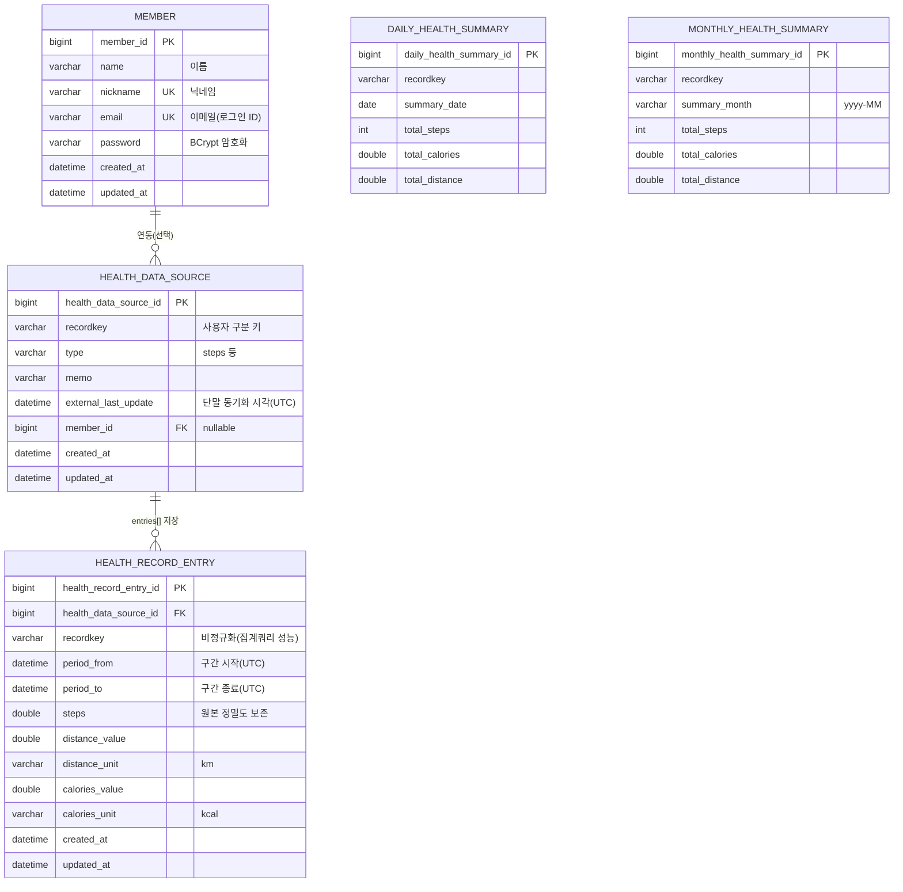

# ERD (Entity Relationship Diagram)

## 설계 코멘트

- **member vs recordkey 분리**: 과제 명세상 회원가입/로그인(이름·닉네임·이메일·패스워드)과 헬스 데이터의 `recordkey`(삼성헬스/애플건강이 발급하는 단말/사용자 식별자)는 서로 다른 발급 주체를 가진 값이라 1:1로 강제 결합하지 않았습니다. `health_data_source.member_id` 를 nullable FK 로 두어, 향후 "회원이 자신의 헬스 연동 계정을 매핑" 하는 흐름으로 자연스럽게 확장 가능하도록 설계했습니다.
- **원본(raw) 테이블과 집계(summary) 테이블 분리**: `health_record_entry` 는 삼성헬스/애플건강에서 내려주는 원본 구간 데이터(대략 10분 단위)를 그대로 보존합니다. `daily_health_summary` / `monthly_health_summary` 는 조회 성능과 "Daily/Monthly 레코드키 기준 조회 결과" 제출 요건을 위해 저장 시점에 미리 집계(upsert)해두는 비정규화 테이블입니다. 재계산이 필요하면 `health_record_entry` 원본으로부터 언제든 다시 산출할 수 있습니다.
- **유니크 제약 (recordkey, period_from, period_to)**: 동일 payload 가 재전송되더라도(App 재동기화, 네트워크 재시도 등) 중복 저장되지 않도록 하는 idempotency 키입니다. 이 제약과 저장 전 존재 여부 체크로 중복 없이 처리됩니다.
- **steps 를 원본 테이블에서는 double, 집계 테이블에서는 int** 로 둔 이유: 입력 데이터의 steps 값이 소수(예: `287.6726411513615`)로 내려오는 경우가 있어 원본은 정밀도를 보존하고, 필드 설명에 명시된 `steps - 걸음수(int)` 스펙은 집계(합산) 이후 반올림하여 맞췄습니다.
